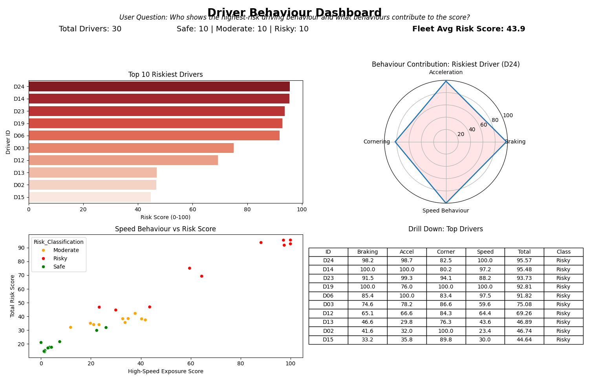
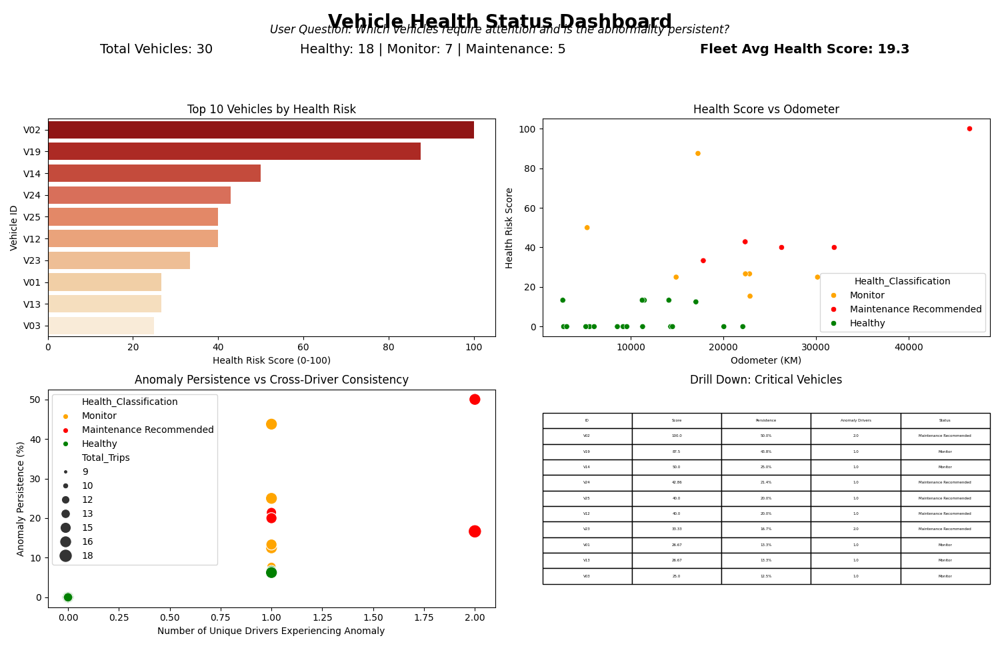

# VEXARDRIVE TECHNOLOGIES
## Data Scientist Intern Assessment
### Technical Analysis Report

**Driver Behaviour Risk & Vehicle Health Analytics**

30 Drivers
30 Vehicles
450 Trips
GPS + IMU Telemetry

Prepared for: VexarDrive Technologies
Assessment: Data Scientist Intern

---

## Executive Summary

### Objective
This project analyzes a week of telematics data (GPS + IMU) to produce a data-driven **Driver Behaviour Risk Score** and a **Vehicle Health Score**.

### Analytical Approach
Our analysis identified specific extreme events (rapid deceleration, rapid acceleration, high rotational-movement, and high-speed exposure) using empirical thresholds derived from Exploratory Data Analysis (EDA). Because official operational bounds and speed limits were unavailable, the methodology relies on dataset-relative thresholds and exposure-normalized rates to fairly evaluate behaviour. 

### Key Outputs

- 30 Drivers
- 30 Vehicles
- 450 Trips
- ~12,987 Telemetry Records

The final dashboards successfully distinguish relative behavioural risk classifications and identify vehicles exhibiting persistent abnormal sensor signatures that may warrant maintenance inspection. 

Importantly, the generated scores represent relative analytical indicators derived from telemetry and are not externally certified safety ratings or confirmed mechanical-failure diagnoses.

---

## Data & Analytical Architecture

### Table Relationships

The analytical tables are structurally joined using the following mapping:

Drivers -> Trips (Driver_ID)
Vehicles -> Trips (Vehicle_ID)
Trips -> Telemetry (Trip_ID)

`Trips.Vehicle_ID` represents the actual vehicle associated with each trip.

### Dataset Quality
After correcting the workbook's header formatting (handling null offsets) and validating data types and relationships, no missing values or corrupt records affecting the analytical metrics were identified. 

---

## Feature Engineering

The raw data lacked explicit orientation information for the IMU sensors and official speed limits. To ensure robustness, we utilized three core engineered features:

### Acceleration Magnitude
`Accel_Magnitude = sqrt(Accel_X_g^2 + Accel_Y_g^2 + Accel_Z_g^2)`

**Purpose**: Provides an orientation-independent measure of the combined accelerometer magnitude.
**Interpretation**: Because the accelerometer includes gravitational and motion components and no device orientation calibration is provided, it is treated as a sensor-motion indicator rather than a direct measurement of mechanical vibration or physical force.

### Gyroscope Magnitude
`Gyro_Magnitude = sqrt(Gyro_X_dps^2 + Gyro_Y_dps^2 + Gyro_Z_dps^2)`

**Purpose**: Acts as an orientation-independent rotational-movement indicator.
**Interpretation**: Measures the intensity of rotational forces during cornering or swerving.

### Minute Speed Change
`Speed_Change_per_min = Speed_kmph(t) - Speed_kmph(t-1)`

**Purpose**: Used to proxy acceleration and deceleration events.
**Limitation**: Minute-to-minute speed changes are behavioural proxies. They do not represent instantaneous physical acceleration.

**Important Interpretation Note:** Sensor-derived values are analytical proxies and should not be interpreted as direct mechanical measurements.

---

## Driver Behaviour Methodology

### 1. Behavioural Metrics
Trip features were aggregated per driver and normalized into **exposure-rates** (events per 100 telemetry minutes) to reduce bias caused by differences in trip duration and observation volume.

### 2. Thresholds
Because the assessment does not provide official operational thresholds, empirical thresholds were derived from the observed telemetry distribution. These thresholds are dataset-relative analytical thresholds rather than industry-standard safety limits:
- **Rapid deceleration threshold**: -25.50 km/h/min
- **Rapid acceleration threshold**: +25.40 km/h/min
- **Rotational/Cornering threshold**: 7.58 dps

### 3. High-Speed Exposure
Because no external speed-limit information is available, we evaluate fleet-relative high-speed exposure.
- **Source variable**: `Speed_kmph`
- **Exact threshold**: > 40 km/h
- **Event definition**: A telemetry minute where the speed strictly exceeds 40 km/h.
- **Aggregation**: Total minutes spent above 40 km/h per driver.
- **Exposure normalization**: Ratio of high-speed minutes to total driving minutes (`High_Speed_Ratio`).

### 4. P95-Relative Normalization
Rates are transformed into normalized 0–100 subscores relative to the 95th-percentile reference value (`P95`). This limits the influence of extreme observations while preserving relative differences.

`Score_Raw = 100 * (Rate / P95)`
`Score = min(Score_Raw, 100)`

---

## Driver Score & Traceability

### 5. Weighted Score

- Braking / Deceleration: 30%
- Acceleration: 30%
- Corner / Rotation: 20%
- Speed Behaviour: 20%
- Total: 100%

The weighted structure combines multiple behavioural dimensions while preventing any single metric from completely determining the overall classification. These are the analytical weightings selected for this assessment, not an industry-standard constraint.

`RiskScore = 0.30B + 0.30A + 0.20C + 0.20S`
*(Where B, A, C, and S are the 0-100 normalized subscores)*

### Traceability Example: Driver D01

**D01 — Score Traceability**

- Braking: 27.427
- Acceleration: 22.066
- Corner: 82.961
- Speed: 34.915

`Risk Score = (27.427 * 0.30) + (22.066 * 0.30) + (82.961 * 0.20) + (34.915 * 0.20)`

**Final Score = 38.42**
**Classification = Moderate**

*Note: Final score uses underlying unrounded values; displayed component values are rounded for readability.*

---

## Vehicle Health Methodology

The objective is to identify vehicles with persistent abnormal sensor signatures that may warrant inspection.

### Visual Methodology Flow
Trip telemetry -> Trip mean acceleration magnitude -> 90th-percentile fleet threshold -> Anomalous trip -> Vehicle-level persistence -> 75th-percentile persistence threshold -> Cross-driver verification -> Maintenance Priority

### Evaluated Thresholds
- **Trip anomaly threshold**: 1.046 g
- **Persistence threshold**: 13.33%

Trips exceeding the 1.046 g threshold exhibit unusually high average acceleration magnitude relative to the observed fleet. 

### Cross-Driver Rule
The cross-driver condition downgrades vehicles whose anomaly evidence is associated with only one driver, reducing the likelihood of attributing driver-specific behaviour to the vehicle.

IF Persistence > 13.33% AND Drivers_With_Anomaly > 1
    THEN Maintenance Recommended
ELSE IF Persistence > 13.33% AND Drivers_With_Anomaly == 1
    THEN Monitor

These are fleet-relative, dataset-derived analytical thresholds and are not industry-standard mechanical maintenance thresholds.

---

## Vehicle Validation

### V02 / V19 Comparison

| Vehicle | Trips | Anomalous Trips | Persistence | Drivers with Anomaly | Classification |
| --- | --- | --- | --- | --- | --- |
| V02 | 16 | 8 | 50.00% | 2 | Maintenance Recommended |
| V19 | 16 | 7 | 43.75% | 1 | Monitor |

While V19 exhibits an anomaly persistence of 43.75% (well above the 13.33% threshold), all anomalous trips were generated by a single assigned driver. V02 satisfies both the persistence and cross-driver criteria and is therefore assigned Maintenance Recommended priority for further inspection.

---

## Dashboard Insights

### Driver Behaviour Dashboard

The Driver Dashboard visualizes relative behavioural risk, allowing the evaluator to isolate drivers who show high-speed exposure but rapid deceleration versus those who drive slowly but exhibit high rotational-movement.

### Vehicle Health Status Dashboard

The Vehicle Dashboard identifies vehicles with persistent acceleration-magnitude anomalies and telemetry patterns that warrant maintenance inspection. The cross-driver scatter plot effectively segments vehicles that require priority inspection from those flagged merely due to driver confounding.

---

## Assumptions & Limitations

### Assumptions
- Accelerometer axis orientation is unknown.
- 3D accelerometer magnitude acts as an orientation-independent sensor-motion indicator.
- Minute-level speed differences are behavioural proxies rather than instantaneous acceleration measurements.
- Official speed limits are unavailable.
- Behavioural thresholds are empirical and dataset-relative.
- Vehicle anomaly thresholds are fleet-relative and dataset-derived.
- Cross-driver persistence reduces but does not eliminate driver-specific confounding.
- Risk/health scores are relative analytical indicators.

### Limitations
- Temporal resolution: One-minute telemetry cannot reconstruct short-duration events.
- Ground truth: No ground-truth risky-driver or mechanical-failure labels are available. The scores are not supervised predictions.
- Context: No road type, weather, traffic, road gradient, or route context.
- Sensor orientation: No phone mounting calibration.
- Vehicle diagnosis: Sensor anomalies may have multiple causes and require physical inspection to diagnose.

---

## Additional Applications

| Application | Current Data | Additional Data Needed |
| --- | --- | --- |
| Driver Coaching | Yes | — |
| Fleet Safety Monitoring | Yes | — |
| Maintenance Prioritization | Yes | Maintenance outcomes for validation |
| Predictive Maintenance | Partial | Failure/maintenance labels |
| Insurance Risk Analysis | Potential | Claims/accident outcomes |

## Conclusion

**Final takeaway:** The assessment demonstrates an explainable, exposure-aware approach to extracting driver-behaviour and vehicle-maintenance signals from GPS and IMU telemetry while explicitly accounting for data limitations and driver/vehicle confounding.

The robust cross-driver validation and empirical, data-derived thresholds successfully navigate the lack of ground-truth labels and official operational bounds, producing defensible and highly actionable insights for fleet safety and vehicle maintenance prioritization.
